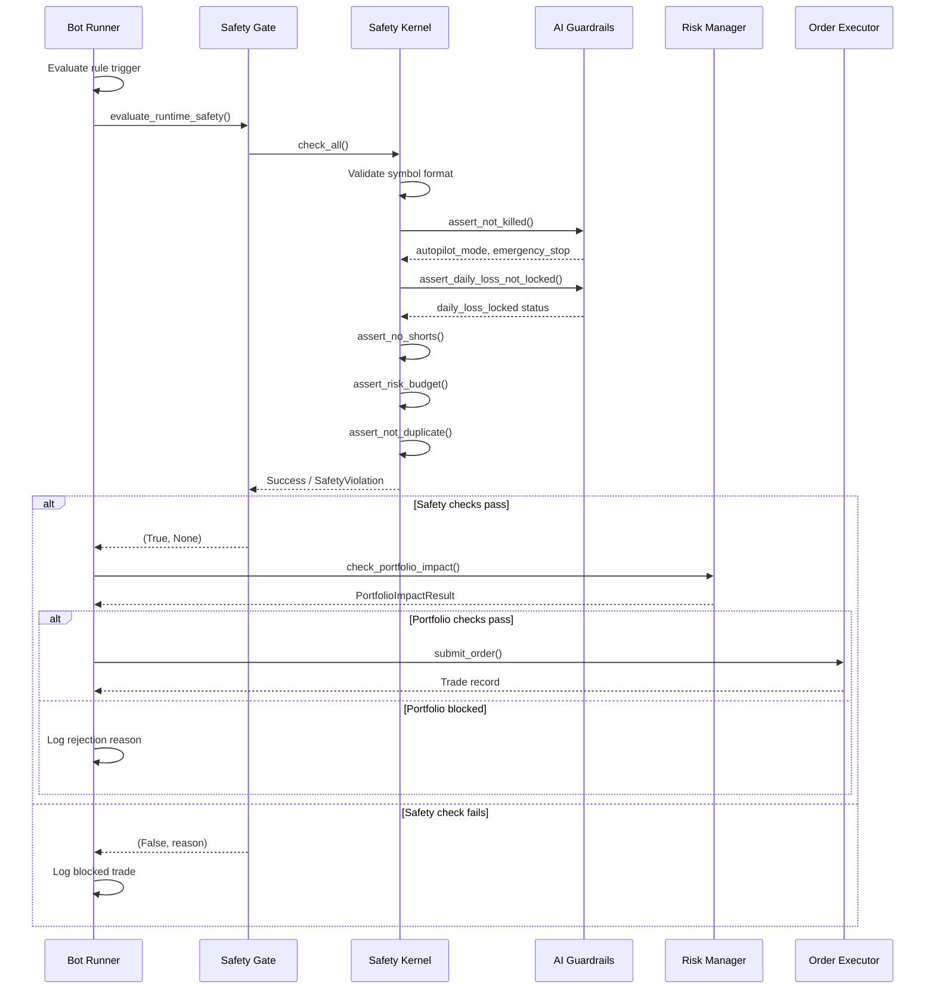

# Trading Bot Safety Architecture

## Overview

This document describes the comprehensive safety architecture of the AI-managed trading bot. The system implements multiple layers of defense to ensure safe operation, with particular focus on AI autonomy controls, risk management, and fail-safe mechanisms.

## Safety Layers

```mermaid
flowchart TB
    subgraph "Layer 1: Configuration & Environment"
        CFG[config.py<br/>Environment Variables]
        RISK_CFG[risk_config.py<br/>RiskLimits Dataclass]
    end

    subgraph "Layer 2: AI Autonomy Controls"
        AI_Guard[ai_guardrails.py<br/>GuardrailEnforcer]
        AutoConfig[Autopilot Config<br/>OFF/PAPER/LIVE]
    end

    subgraph "Layer 3: Runtime Safety Kernel"
        SafetyKernel[safety_kernel.py<br/>check_all()]
        CircuitBreaker[Consecutive Failure<br/>Circuit Breaker]
    end

    subgraph "Layer 4: Risk Management"
        RiskMgr[risk_manager.py<br/>Portfolio Impact Checks]
        PositionSize[Position Sizing<br/>Methods]
    end

    subgraph "Layer 5: Order Execution"
        OrderExec[order_executor.py<br/>Order Validation]
        SafetyGate[safety_gate.py<br/>Runtime Safety Wrapper]
    end

    subgraph "Layer 6: Bot Runner"
        BotRunner[bot_runner.py<br/>Rule Execution]
    end

    BotRunner --> SafetyGate
    SafetyGate --> SafetyKernel
    SafetyKernel --> AI_Guard
    SafetyKernel --> RiskMgr
    RiskMgr --> RISK_CFG
    AI_Guard --> AutoConfig
    AutoConfig --> CFG
    OrderExec --> SafetyGate
```

---

## Layer 1: Configuration & Environment

### config.py
**Purpose**: Central configuration loaded from environment variables

**Key Safety Settings**:
| Setting | Description | Default |
|---------|-------------|---------|
| `AUTOPILOT_MODE` | AI authority level: OFF/PAPER/LIVE | OFF |
| `IS_PAPER` | Connect to IBKR paper account | true |
| `SIM_MODE` | Virtual trading mode (no real orders) | false |
| `RISK_PER_TRADE_PCT` | Max risk per trade (% of account) | 1.0 |
| `MAX_TOTAL_DRAWDOWN` | Max account drawdown before pause | 18% |
| `MAX_DAILY_RISK` | Daily loss limit | 3% |
| `SHORT_ALLOWED` | Enable short selling | false |
| `MAX_POSITIONS_TOTAL` | Hard cap on open positions | 100 |
| `MAX_POSITIONS_PER_SECTOR` | Sector concentration limit | 3 |

**Validation**:
- Port validation (paper vs live ports)
- JWT secret validation in LIVE mode
- Config consistency checks

### risk_config.py
**Purpose**: Single source of truth for risk limit constants

**RiskLimits Dataclass**:
```python
@dataclass
class RiskLimits:
    max_position_pct: float = 10.0        # Max position as % of account
    max_sector_pct: float = 30.0          # Max sector exposure
    max_correlated_positions: int = 3     # Correlation limit
    corr_threshold: float = 0.80          # Pearson correlation threshold
    max_daily_loss_pct: float = 2.0       # Daily loss limit
    max_drawdown_pct: float = 10.0        # Drawdown trigger
    max_open_positions: int = 20          # Position count cap
    position_sizing_method: str = "fixed_fractional"
    atr_multiplier: float = 2.0
    kelly_fraction: float = 0.25          # Quarter-Kelly cap
    risk_per_trade_pct: float = 1.0       # Core risk budget
```

---

## Layer 2: AI Autonomy Controls

### ai_guardrails.py
**Purpose**: Uncertainty-aware enforcement for all AI-initiated changes

**Key Components**:

#### GuardrailConfigResponse
Stored in database with fields:
- `autopilot_mode`: OFF/PAPER/LIVE
- `ai_autonomy_enabled`: Boolean
- `shadow_mode`: Boolean (PAPER mode)
- `emergency_stop`: Boolean kill switch
- `daily_loss_locked`: Boolean daily loss lock
- `daily_loss_limit_pct`: Float threshold

#### GuardrailEnforcer
```python
class GuardrailEnforcer:
    async def can_execute(action_type, proposed_change, confidence) -> (bool, str)
    async def execute_with_audit(action_type, change, confidence)
```

**Checks Performed**:
1. **Emergency Stop**: Global kill switch
2. **AI Autonomy**: Is AI enabled?
3. **Daily Budget**: max_changes_per_day limit
4. **Cooldown**: min_hours_between_changes
5. **Action-Specific Limits**:
   - `rule_disable`: max_rules_disabled_per_day
   - `position_size_change`: Max delta limits
   - `stop_change`: Conservative vs aggressive bounds

**Confidence-Scaled Limits**:
```
max_allowed = base_limit * confidence
```
- Conservative actions (disable rule): Use upper bound
- Aggressive actions (increase size): Use lower bound

#### Shadow Mode Analysis
- Tracks AI suggestions vs actual decisions
- Computes hit rates and effect sizes
- Gating conditions for LIVE promotion:
  - min_decisions (default: 100)
  - min_days (default: 15)
  - hit_rate threshold (default: 0.55)
  - effect_size threshold (default: 0.0)

---

## Layer 3: Runtime Safety Kernel

### safety_kernel.py
**Purpose**: Non-negotiable runtime checks for AI-managed actions

#### check_all() Function
**Signature**:
```python
async def check_all(
    symbol: str,
    side: str,
    quantity: int,
    source: str,
    account_equity: float = 0,
    price_estimate: float = 0,
    *,
    stop_price: float | None = None,
    is_exit: bool = False,
    has_existing_position: bool = False,
    require_autopilot_authority: bool = True,
) -> None
```

**Checks Executed**:

| Check | Function | Description |
|-------|----------|-------------|
| Symbol Validation | `symbol.strip().upper()` + regex | Validates symbol format |
| Autopilot Authority | `assert_not_killed()` | Checks OFF mode & emergency stop |
| Daily Loss Lock | `assert_daily_loss_not_locked()` | Blocks new entries if daily loss exceeded |
| Short Selling | `assert_no_shorts()` | Blocks sell-to-open |
| Risk Budget | `assert_risk_budget()` | Enforces 1% risk per trade |
| Duplicate Orders | `assert_not_duplicate()` | 5-second dedup window |

#### Risk Budget Calculation
```python
max_risk = account_equity * cfg.RISK_PER_TRADE_PCT / 100
if stop_price:
    risk_amount = abs(price_estimate - stop_price) * quantity
else:
    risk_amount = quantity * price_estimate  # Conservative fallback

if risk_amount > max_risk:
    raise SafetyViolation("Per-trade risk exceeds limit")
```

#### Consecutive Failure Circuit Breaker
```python
CONSECUTIVE_FAILURE_THRESHOLD = cfg.AI_CONSECUTIVE_FAILURE_THRESHOLD  # default: 3

# Track failures per source
_failure_counts: dict[str, int]

# On threshold exceeded:
# 1. Set emergency_stop = True
# 2. Log circuit_breaker_trip action
# 3. Optionally close all positions
```

**Functions**:
- `record_ai_success(source)`: Resets failure counter
- `record_ai_failure(source)`: Increments counter, may trip breaker
- `trip_circuit_breaker(source, close_positions)`: Activates emergency stop
- `reset_circuit_breaker()`: Manual reset after human review

---

## Layer 4: Risk Management

### risk_manager.py
**Purpose**: Portfolio-level risk checks and position sizing

#### check_portfolio_impact()
**Signature**:
```python
def check_portfolio_impact(
    symbol: str,
    side: str,
    positions: list[dict],
    net_liq: float,
    candidate_notional: float = 0,
    pending_orders: list[dict] | None = None,
    approved_candidates: list[dict] | None = None,
    corr_matrix: dict | None = None,
    limits: RiskLimits | None = None,
) -> PortfolioImpactResult
```

**Checks**:

1. **Exit Bypass**: SELL/SELL_EXIT/EXIT always pass
2. **Sector Concentration**:
   ```
   sector_weight_after = (existing + new) / net_liq * 100
   if sector_weight_after > max_sector_pct: BLOCK
   ```
3. **Correlation Limit**:
   ```
   Count positions where |corr(candidate, existing)| > corr_threshold
   if count >= max_correlated_positions: BLOCK
   ```
4. **Degraded Data Handling**:
   - If sector unknown AND no correlation matrix: BLOCK
   - If sector known but no correlation: ALLOW with warning

#### calculate_position_size()
**Methods**:
- `fixed_fractional`: Risk fixed % per trade
- `kelly`: Fractional Kelly criterion (capped at 0.25)
- `equal_weight`: Divide account evenly
- `atr`: Normalize by N × ATR

**Formula (fixed_fractional)**:
```python
risk_amount = account_value * (risk_pct / 100)
risk_per_share = abs(entry_price - stop_price)
shares = floor(risk_amount / max(risk_per_share, 0.01))
```

---

## Layer 5: Order Execution

### safety_gate.py
**Purpose**: Shared runtime safety gate orchestration

```python
async def evaluate_runtime_safety(
    symbol: str,
    side: str,
    quantity: int,
    source: str,
    account_equity: float = 0.0,
    price_estimate: float = 0.0,
    stop_price: float | None = None,
    is_exit: bool = False,
    has_existing_position: bool = False,
    require_autopilot_authority: bool = True,
) -> tuple[bool, str | None]
```

**Returns**: `(allowed: bool, reason: str | None)`

### order_executor.py
**Purpose**: Order execution with safety checks

**Key Safety Features**:
- MKT order conversion to LIMIT for extended hours
- Pending order reconciliation on startup
- Fill callbacks for exit tracking
- Partial fill handling
- Order status event subscription

---

## Layer 6: Bot Runner

### bot_runner.py
**Purpose**: Main trading loop execution

**Safety Integration**:
```python
# In _execute_trade():
allowed, reason = await evaluate_runtime_safety(
    symbol=symbol,
    side=side,
    quantity=qty,
    source="bot_runner",
    account_equity=account_equity,
    price_estimate=price,
    stop_price=stop,
    is_exit=is_exit,
    has_existing_position=has_position,
)
if not allowed:
    log.warning("Trade blocked by safety gate: %s", reason)
    return None
```

**Pre-Trade Checks**:
1. Autopilot mode validation
2. Daily loss lock check
3. Risk budget verification
4. Portfolio impact assessment
5. Duplicate order prevention

---

## Safety Flow Diagram



---

## Emergency Procedures

### Circuit Breaker Activation
```python
# Automatic activation when:
# - CONSECUTIVE_FAILURE_THRESHOLD failures from same source

# Effects:
# 1. emergency_stop = True
# 2. All new AI entries blocked
# 3. Optional: Close all positions
# 4. Audit log entry created

# Recovery:
# - Manual reset via reset_circuit_breaker()
# - Requires human review
```

### Daily Loss Lock
```python
# Activation:
# - When daily loss exceeds daily_loss_limit_pct

# Effects:
# 1. daily_loss_locked = True
# 2. New entries blocked
# 3. Exits still allowed

# Recovery:
# - Automatic reset at next trading day
# - Or manual override
```

### Emergency Stop
```python
# Activation methods:
# 1. Circuit breaker trip
# 2. Manual activation via API/UI
# 3. Database direct update

# Effects:
# 1. emergency_stop = True
# 2. All AI autonomy disabled
# 3. Manual trading only

# Recovery:
# - Manual deactivation via API/UI
```

---

## Configuration Matrix

| Mode | AUTOPILOT_MODE | IS_PAPER | SIM_MODE | Behavior |
|------|---------------|----------|----------|----------|
| Manual | OFF | any | any | Human trading only |
| Paper AI | PAPER | true | false | AI trades paper account |
| Simulated | PAPER/LIVE | any | true | Virtual trading, no real orders |
| Live AI | LIVE | false | false | AI trades real money |

---

## Audit Trail

All safety events are logged to `ai_audit_log`:

| Field | Description |
|-------|-------------|
| timestamp | UTC timestamp |
| action_type | Type of action (circuit_breaker_trip, rule_disable, etc.) |
| category | Safety category |
| description | Human-readable description |
| old_value | Previous state |
| new_value | New state |
| reason | Why the action was taken |
| confidence | AI confidence score |
| status | applied/reverted/pending |

---

## Best Practices

1. **Always start in PAPER mode** when testing new strategies
2. **Monitor circuit breaker status** regularly
3. **Review shadow decisions** before promoting to LIVE
4. **Set conservative risk limits** initially
5. **Enable all hardening flags** in LIVE mode:
   - `ENABLE_PORTFOLIO_CONCENTRATION_ENFORCEMENT`
   - `ENABLE_RULE_BACKTEST_GATE`
   - `ENABLE_BOT_HEALTH_MONITORING`
6. **Regular audit log reviews** for anomaly detection
7. **Test emergency procedures** in paper mode

---

## File Reference

| File | Purpose | Key Functions/Classes |
|------|---------|---------------------|
| `config.py` | Environment configuration | `Config`, `cfg` |
| `risk_config.py` | Risk limit constants | `RiskLimits`, `DEFAULT_LIMITS` |
| `risk_manager.py` | Portfolio risk checks | `check_portfolio_impact()`, `calculate_position_size()` |
| `safety_kernel.py` | Core safety checks | `check_all()`, `SafetyViolation`, circuit breaker |
| `safety_gate.py` | Safety wrapper | `evaluate_runtime_safety()` |
| `ai_guardrails.py` | AI autonomy controls | `GuardrailEnforcer`, shadow analysis |
| `order_executor.py` | Order execution | `submit_order()`, `reconcile_pending_orders()` |
| `bot_runner.py` | Main trading loop | `_execute_trade()`, `_run_cycle()` |
